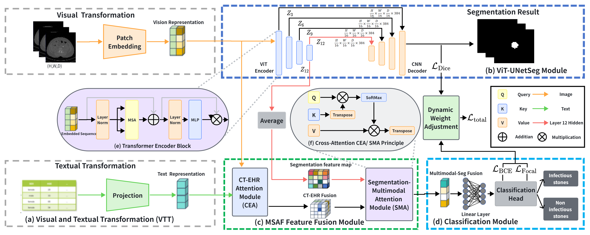
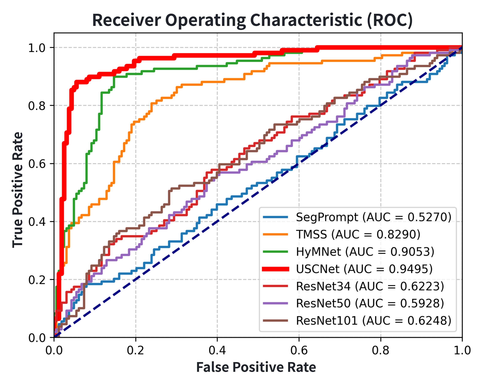
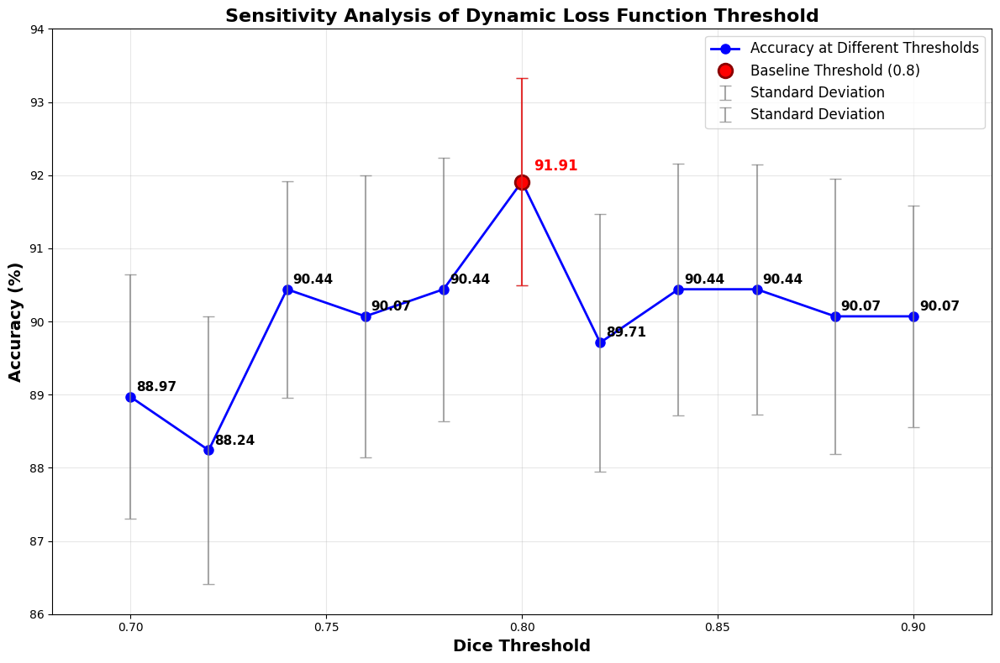

# USCNet: A Deep Learning Framework for Kidney Stone Composition Analysis

This repository contains the official implementation of **USCNet** (U-Net and Swin Transformer based Cascade Network) for automated kidney stone composition analysis from CT images.

## Overview

Kidney stone composition analysis is crucial for determining appropriate treatment strategies. This project proposes a deep learning-based method for automatic kidney stone segmentation and composition classification from 3D CT images.

## Architecture

### USCNet Framework

The proposed framework consists of two main components:

1. **SC_Net (Segmentation and Classification Network)**: A hybrid architecture combining 3D ResNet encoder with Vision Transformer for simultaneous kidney stone segmentation and composition classification.

2. **TMSS (Triple-Module Segmentation System)**: A multi-task learning framework that integrates image features with clinical data (EHR) for improved classification performance.



### Key Modules

- **(a) Visual and Textual Transformation (VTT)**: Converts CT images and clinical text data into unified representations
- **(b) ViT-UNetSeg Module**: Vision Transformer-based segmentation with U-Net decoder
- **(c) MSAF Feature Fusion Module**: Multi-modal feature fusion between CT and EHR data
- **(d) Classification Module**: Final classification head for stone type prediction
- **(e) Transformer Encoder Block**: Standard transformer encoder with MSA and MLP
- **(f) Cross-Attention CEA/SMA Principle**: Cross-modal attention mechanism

## Project Structure

```
.
├── configs/
│   ├── config.yaml          # Validation and metrics configuration
│   └── dataset.json         # Dataset paths and settings
├── figures/                 # Result figures and visualizations
├── src/
│   ├── dataloader/
│   │   └── load_data.py     # Data loading and preprocessing
│   └── models/
│       ├── networks/
│       │   ├── sc_net.py    # Main SC_Net model implementation
│       │   ├── resnet.py    # 3D ResNet backbone
│       │   ├── module.py    # ResEncoder and CAL_Net
│       │   └── nets.py      # UNETR, DoubleFlow, and other models
│       └── SegPrompt/       # SegPrompt-related modules
├── train.py                 # Training script
├── test.py                  # Testing/Inference script
├── trainer.py               # Trainer class implementation
├── inference.py             # Inference script for new data
├── prepare_dataset.py       # Dataset preparation tools
├── auc.py                   # AUC evaluation and visualization
├── TMSS.py                  # Triple-Module Segmentation System
└── utils.py                 # Utility functions
```

## Installation

### Requirements

- Python >= 3.8
- PyTorch >= 1.10
- MONAI >= 0.9
- SimpleITK
- NumPy
- Pandas
- scikit-learn
- matplotlib
- seaborn

### Setup

```bash
pip install -r requirements.txt
```

## Dataset Preparation

The dataset should be organized as follows:

```
data/
├── cropped_img/          # Preprocessed CT images (.nii.gz)
├── cropped_mask/         # Segmentation masks (.nii.gz)
├── clinical.xlsx         # Clinical data (optional)
└── clinical_infos.json   # Dataset information file
```

### Dataset Configuration

Edit `configs/dataset.json` to specify your data paths:

```json
{
  "data_dir": "path/to/your/data",
  "infos_name": "clinical_infos.json",
  "img_dir": "cropped_img",
  "mask_dir": "cropped_mask",
  "filter_volume": 0.006,
  "clinical_dir": "clinical.xlsx"
}
```

## Usage

### Training

To train the SC_Net model:

```bash
python train.py \
    --config-file configs/config.yaml \
    --task [0,1] \
    --input-size "48,48,48" \
    --num-classes 2 \
    --epochs 100 \
    --batch-size 8 \
    --lr 0.0001 \
    --device cuda
```

Arguments:
- `--task`: Training tasks, [0] for segmentation only, [1] for classification only, [0,1] for both
- `--input-size`: Input image size (D,H,W)
- `--num-classes`: Number of classification classes
- `--epochs`: Number of training epochs
- `--batch-size`: Batch size
- `--lr`: Learning rate

### Testing/Inference

To evaluate a trained model:

```bash
python test.py \
    --config_file configs/config.yaml \
    --task [0,1] \
    --pretrain_sc path/to/checkpoint.pth \
    --input_path path/to/data \
    --batch-size 8
```

### Inference on New Data

For single image:

```bash
python inference.py \
    --checkpoint path/to/best_checkpoint.pth \
    --input /path/to/image.nii.gz \
    --output /path/to/segmentation.nii.gz
```

## Results

### Performance Comparison

USCNet achieves state-of-the-art performance compared to baseline methods:

| Method | AUC |
|--------|-----|
| SegPrompt | 0.5270 |
| ResNet50 | 0.5928 |
| ResNet34 | 0.6223 |
| ResNet101 | 0.6248 |
| TMSS | 0.8290 |
| HyMNet | 0.9053 |
| **USCNet (Ours)** | **0.9495** |

### ROC Curve



The ROC curve demonstrates that USCNet significantly outperforms other methods in kidney stone composition classification.

### Threshold Sensitivity Analysis



The dynamic loss function achieves optimal performance at a Dice threshold of 0.8, with an accuracy of 91.91%.

## Model Details

### SC_Net Architecture

SC_Net consists of:
- **Encoder**: 3D ResNet (ResNet-10) for multi-scale feature extraction
- **Transformer**: Vision Transformer (ViT) for global context modeling
- **Decoder**: Skip-connected decoder with attention gates for segmentation
- **Classifier**: Global average pooling + MLP for composition classification

### Key Features

1. **Multi-task Learning**: Joint optimization of segmentation and classification
2. **Attention Gates**: Channel and spatial attention for better feature fusion
3. **Skip Connections**: Preserve spatial information from encoder to decoder
4. **Clinical Integration**: Optional EHR data fusion (in TMSS)
5. **Dynamic Loss**: Adaptive threshold for improved training stability

## Citation

If you find this code useful for your research, please cite our paper:

```bibtex
@article{uscnet2024,
  title={USCNet: A U-Net and Swin Transformer based Cascade Network for Kidney Stone Composition Analysis},
  author={Your Name et al.},
  journal={Medical Image Analysis},
  year={2024}
}
```

## License

This project is released under the MIT License.

## Acknowledgments

- This work was supported by [Your Institution]
- We thank the contributors of MONAI for the excellent medical imaging library
